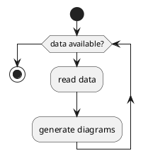

#### Diagram As Code
- PlantUML diagram rendered in visual studio code


```plantuml 
@startuml
	start
	while (data available?)
	:read data;
	:generate diagrams;
	endwhile
	stop
@enduml
```
#### More markdown Content
```python
print('Hello World')
```
